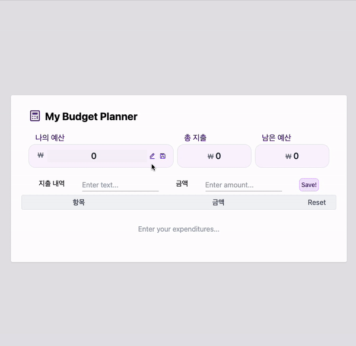
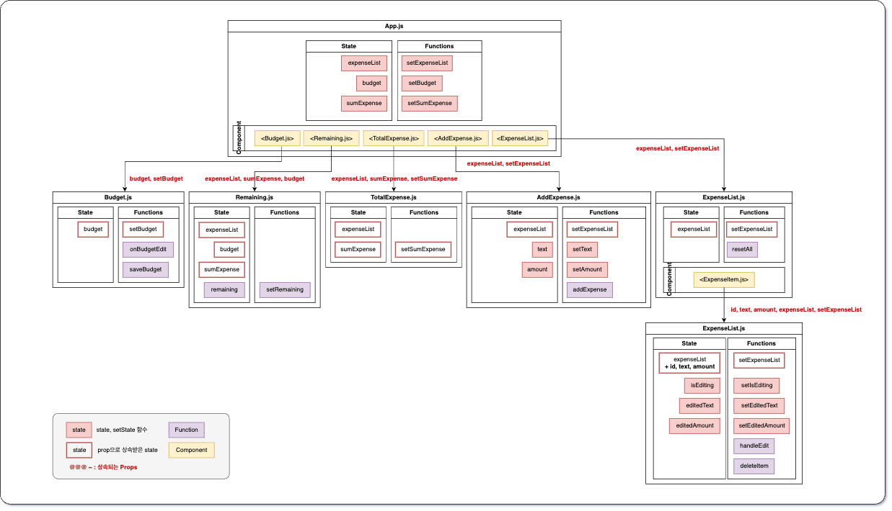

# Budget Calculator - react & javascript

goormthon fullstack training PBL 05

### Preview



### 주요 기능

1. 지출 내역을 입력 및 저장해 리스트로 표시 (저장 : localStorage)
2. 지출 내역이 업데이트 될 때마다 상단에 총 지출액을 합산하여 표시
3. 나의 예산 금액을 설정해두면, 지출에 따른 잔여 예산 금액을 표시

### 과제

1. 최대한 컴포넌트를 나눠서 구현
2. 폴더 이름 및 변수 이름 명확히 작성

### 기술 스택

- 라이브러리 : React(Create-React-App), Tailwind CSS
- 언어 : JavaScript
- docker

### 컴포넌트 구조

```
├─ Index.js
├─ App.js
└─ components
    ├─ AddExpense.js
    ├─ Budget.js
    ├─ ExpenseItem.js
    ├─ ExpenseList.js
    ├─ Remaining.js
    └─ TotalExpense.js
```



---

This project was bootstrapped with [Create React App](https://github.com/facebook/create-react-app).
